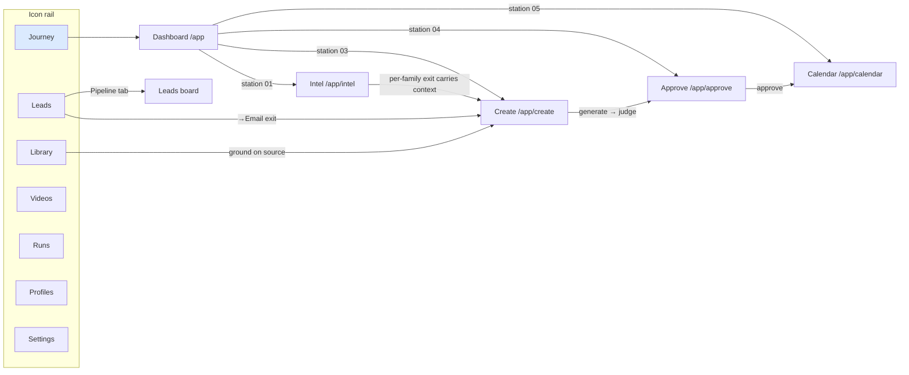

# FEATURE MAP — every feature, and how a HUMAN reaches it

> Founder direction (s60, live): "you have to have all of the functions and
> features mapped out and have a link/line between them so that you and I can
> see how each feature can be accessed/opened. You might be able to access it
> via code, but for a human, that's not how we access it."
>
> This file is the map of record. **A feature that ships without a row here —
> or whose only access path is a URL nobody is shown — is a defect** (the
> W-audit sweep enforces it). Keep it updated in the same change that adds or
> moves a feature. Status: `reachable` · `partial` (reachable but a human
> path is missing somewhere) · `ORPHANED` (exists, no human path).

## The journey (the spine IS the map)

## Surfaces + their features

| Feature | Human path | Status |
|---|---|---|
| Journey dashboard (stations, week strip, needs-you) | rail → Journey, or `/app` | reachable |
| Intel trends + dossier launchpad | spine station 01 → "Open intel", or nothing in rail (journey surface) | reachable |
| Intel: original-post link | expanded dossier card → "original post ↗" | **partial — expanded card ONLY; rising-list rows and station-01 peek have no way back (Source-Link Rule breach)** |
| Intel: search/horizon tab | Intel → "Search" tab | reachable |
| Intel: watchlist add/pause | Intel header chip row | reachable |
| Intel: Sweep now | Intel header | reachable |
| Pick (context capture) | dossier card per-family exits (→Video · →Post · →Page) | reachable (state, not route — by design) |
| Create: one-prompt + Advanced | station 03 → "Open create"; family tabs | reachable |
| Create: context chips seam | arrive via an intel/lead exit (`?ctx=`) | reachable (only via exits — by design, documented here) |
| Create: →Email compose (lead outreach) | Leads → lead card → "Email" exit | reachable |
| Approve: queue + consent detail | station 04 → "Review queue"; topbar needs-you chip | reachable |
| Approve: judge verdicts verbatim | approve detail panel | reachable |
| Approve: batch approve, edit/re-judge, staged walk | approve list header + detail actions | reachable |
| Calendar month/week/agenda | station 05 → "Open calendar"; ⌘K | reachable |
| Leads list + triage (score, hot, dismiss, import, waitlist) | rail → Leads | reachable |
| Leads board (Pipeline) | Leads → "Pipeline" tab | reachable |
| Learn-from-feedback loop | Leads → scoring-weights strip → "Learn from feedback" | reachable |
| Library: ingest URL/captions, transcript, export, delete | rail → Library | reachable |
| Library: way back to the source URL | — | **ORPHANED — the DB stores `sources.uri` but no surface ever renders it; a pasted URL is unrecoverable by a human (Source-Link Rule breach)** |
| Source thumbnails (library + intel) | — | **missing everywhere — no visual identity for any ingested/ranked source** |
| Videos: projects, cuts, takes, propose | rail → Videos | **partial — the surface works but is EMPTY of content: zero video_projects rows exist** |
| Concept film (s41–44) | /app/videos → thalon-concept-film (dev: REGISTERED + playable — 58 takes, 8 cuts, media route verified s61) | **staging pending per-box import (ASK-BACKS s61 → swordfish); was mis-read as globally orphaned at s60** |
| Runs history + failure triage | rail → Runs | reachable |
| Profiles (brand voice, versions) | rail foot → Profiles; topbar switcher → "Manage profiles" | reachable |
| Settings (seams, drivers, budget, watchlist) | rail foot → Settings | reachable |
| ⌘K command palette | topbar button; Ctrl/⌘-K | reachable |
| Own-site blog (published pages land here) | `/blog` — public site, not linked from the workspace | **partial — no workspace path to what got published** |
| Portfolio sites (15 landing pages) | — (8899 dev preview only) | **ORPHANED from the workspace — W-sites queued (`docs/research/sites-surface-plan.md`) is the fix** |
| Template `/guide` pages | each site → footer "how this page was made" | reachable (within each site) |
| Send door (B-crm.4, disarmed) | Leads → Email compose → the door states its disarmed status | reachable (honest door) |

## Standing rule this file enforces

Every feature row must name a path a human can CLICK to reach it, starting
from the rail or a station. "It has a URL" is not a path; "the code can call
it" is not a path. New feature = new row, same change. The W-audit sweep
(queued s60) turns the `partial`/`ORPHANED` rows above into work items.

*Created s60 on founder direction, after the founder clicked Videos and found
the product had no path to its own film. Owner: lead; audited at W-audit.*
