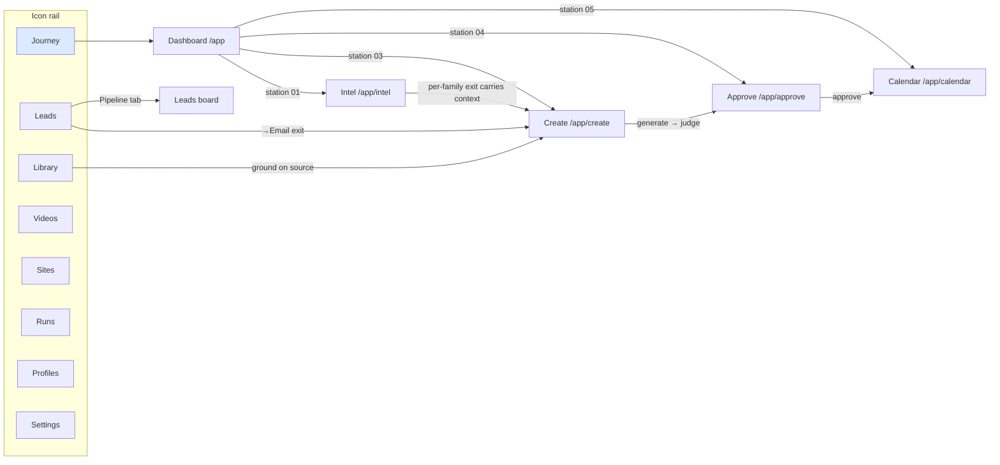

# FEATURE MAP — every feature, and how a HUMAN reaches it

> Founder direction (s60, live): "you have to have all of the functions and
> features mapped out and have a link/line between them so that you and I can
> see how each feature can be accessed/opened. You might be able to access it
> via code, but for a human, that's not how we access it."
>
> This file is the map of record. **A feature that ships without a row here —
> or whose only access path is a URL nobody is shown — is a defect** (the
> W-audit sweep enforces it). Keep it updated in the same change that adds or
> moves a feature. Status: `reachable` · `partial` (reachable but a human
> path is missing somewhere) · `ORPHANED` (exists, no human path).

## The journey (the spine IS the map)

## Surfaces + their features

| Feature | Human path | Status |
|---|---|---|
| Journey dashboard (stations, week strip, needs-you) | rail → Journey, or `/app` | reachable |
| Intel trends + dossier launchpad | spine station 01 → "Open intel", or nothing in rail (journey surface) | reachable |
| Intel: original-post link | expanded dossier card → "original post ↗" · every rising row → ↗ anchor · station-01 peek → "original post ↗" | reachable (Source-Link sweep, s62 — conformance-tested) |
| Intel: search/horizon tab | Intel → "Search" tab | reachable |
| Intel: watchlist add/pause | Intel header chip row | reachable |
| Intel: Sweep now | Intel header | reachable |
| Pick (context capture) | dossier card per-family exits (→Video · →Post · →Page) | reachable (state, not route — by design) |
| Create: one-prompt + Advanced | station 03 → "Open create"; family tabs | reachable |
| Create: context chips seam | arrive via an intel/lead exit (`?ctx=`) | reachable (only via exits — by design, documented here) |
| Create: →Email compose (lead outreach) | Leads → lead card → "Email" exit | reachable |
| Approve: queue + consent detail | station 04 → "Review queue"; topbar needs-you chip | reachable |
| Approve: judge verdicts verbatim | approve detail panel | reachable |
| Approve: batch approve, edit/re-judge, staged walk | approve list header + detail actions | reachable |
| Calendar month/week/agenda | station 05 → "Open calendar"; ⌘K | reachable |
| Leads list + triage (score, hot, dismiss, import, waitlist) | rail → Leads | reachable |
| Leads board (Pipeline) | Leads → "Pipeline" tab | reachable |
| Learn-from-feedback loop | Leads → scoring-weights strip → "Learn from feedback" | reachable |
| Library: ingest URL/captions, transcript, export, delete | rail → Library | reachable |
| Library: way back to the source URL | shelf row → ↗ anchor beside the row; open transcript header → the linked URL | reachable (Source-Link sweep, s62; non-web uris stay identity text, never fake links) |
| Source thumbnails (library + intel) | library shelf rows + intel cards/rising rows show them where captured | partial by data, not by code — plumbed end-to-end (oEmbed `meta.thumbnailUrl` at ingest; `thumbnailUrl` through sweep→wire): NEW library ingests carry one; pre-rider rows and demo intel cards honestly have none; live intel thumbs arrive with the B6.5 platform drivers |
| Videos: projects, cuts, takes, propose | rail → Videos | reachable (dev: the concept film registered + playable since s61; staging follows the swordfish import) |
| Concept film (s41–44) | /app/videos → thalon-concept-film (dev: REGISTERED + playable — 58 takes, 8 cuts, media route verified s61) | **staging pending per-box import (ASK-BACKS s61 → swordfish); was mis-read as globally orphaned at s60** |
| Runs history + failure triage | rail → Runs | reachable |
| Profiles (brand voice, versions) | rail foot → Profiles; topbar switcher → "Manage profiles" | reachable |
| Settings (seams, drivers, budget, watchlist) | rail foot → Settings | reachable |
| Integrations (destination cards, honest states, guided connect, validate/disconnect) | Settings → "Manage integrations" → /app/settings/integrations | reachable (B-int.2, s70 — vault-backed; env-override badge names the emergency-override posture) |
| ⌘K command palette | topbar button; Ctrl/⌘-K | reachable |
| Own-site blog (published pages land here) | `/blog` — public; workspace path = Settings → Integrations → Published (the ledger view joins social publications + blog posts, every row with its way back) | reachable (B-int.2 published view, s70 — partial closed) |
| Sites gallery (the portfolio in the workspace) | rail → Sites | reachable (W-sites, s61 — facet chips, j/k/enter, verdict chips) |
| Sites dossier (live preview + record + /guide) | Sites → a card → dossier (iframe w/ desktop/390 toggles) | reachable (dev reads the local dir; staging origin arms with the founder's Dokploy service + `TEMPLATES_PREVIEW_ARMED`) |
| Template `/guide` pages | each site → footer "how this page was made" | reachable (within each site) |
| Send door (B-crm.4, disarmed) | Leads → Email compose → the door states its disarmed status | reachable (honest door) |

## The storage story (audited s62 — W-audit item e)

**Rule (founder question, s60): every save/export/import path is server-side
system-of-record; the client machine only ever gets COPIES.** Audited s62 by
sweeping the client code for `localStorage`/`sessionStorage`/`IndexedDB`/blob
paths — one violation found and fixed in the same change (board saved views
lived per-browser; now the tenant-wide `saved_views` store via `/api/views`,
with a one-time localStorage migration that retires the key).

| Data class | System of record | Notes |
|---|---|---|
| Relational (tenants → drafts → leads → captures, 0001–0015) | dev: Postgres 17 on this box · staging: `tenant-pg` on the VPS | per-box databases; staging nightly `pg_dumpall` 15:00 UTC rides the swordfish restic set |
| Object store (transcripts, sweep bundles, film/video media, render refs) | per-box volumes behind the platform `ObjectStore` seam | **dev and staging stores are SEPARATE per-box volumes — dogfood imports (the concept film) run per environment** (dev registered s61; staging rides the swordfish import). AWS/S3 parked with an explicit trigger (real traffic/customers, founder s60); the seam stays fail-loud |
| Saved views (board/calendar tabs) | `saved_views` table (Phase-I window; wired s62) | client localStorage = one-time migration source, then retired |
| Film source masters (takes/cuts/sidecars) | gitignored `.context` design tree on the dev box | the import script materializes them INTO each environment's product store |
| Portfolio sites | git (this repo) + the templates image | the workspace reads the built catalog through the provider seam, read-only |
| Client-bound flows | copies only | library exports (.txt/.csv/.srt/.md) + copy-brief are generated downloads; CSV lead import is parsed server-side and the file discarded (stated in UI); the CSV template is a static download |

New surface rule: anything that persists operator state ships against a
server-side store (or an honest "not stored" statement in the UI) — a
client-only record is a defect this section's sweep hunts.

## Standing rule this file enforces

Every feature row must name a path a human can CLICK to reach it, starting
from the rail or a station. "It has a URL" is not a path; "the code can call
it" is not a path. New feature = new row, same change. The W-audit sweep
(queued s60) turns the `partial`/`ORPHANED` rows above into work items.

*Created s60 on founder direction, after the founder clicked Videos and found
the product had no path to its own film. Owner: lead; audited at W-audit.*
